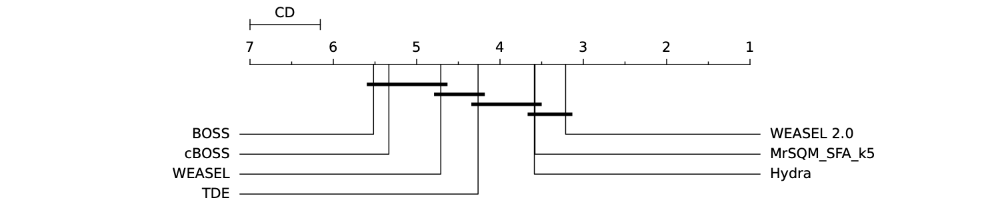

# WEASEL 2.0 - A Random Dilated Dictionary Transform for Fast, Accurate and Constrained Memory Time Series Classification

WEASEL 2.0 combines a novel dilation mapping, small dictionaries and hyper-parameter ensembling to obtain a fast, accurate, and constrained memory TSC. WEASEL 2.0 is significantly more accurate than its predecessor dictionary methods (BOSS, TDE, WEASEL), and in the same group as SotA non-ensemble methods. 

<p float="center">
  
</p>

## Installation

### Dependencies
```
sktime >= 0.13,<=0.15
```

### Building

First, download the repository.
```
git clone https://github.com/patrickzib/dictionary.git
```

Then build package from source.
```
pip install .
```


### Train a WEASEL 2.0 classifier

WEASEL v2 follows the sktime pipeline.

```python
from sktime.datasets import load_arrow_head
from weasel.classification.dictionary_based import WEASEL_V2

X_train, y_train = load_arrow_head(split="train", return_type="numpy3d")
X_test, y_test = load_arrow_head(split="test", return_type="numpy3d")
clf = WEASEL_V2(random_state=1379, n_jobs=4)
clf.fit(X_train,y_train)
clf.predict(X_test)
```
